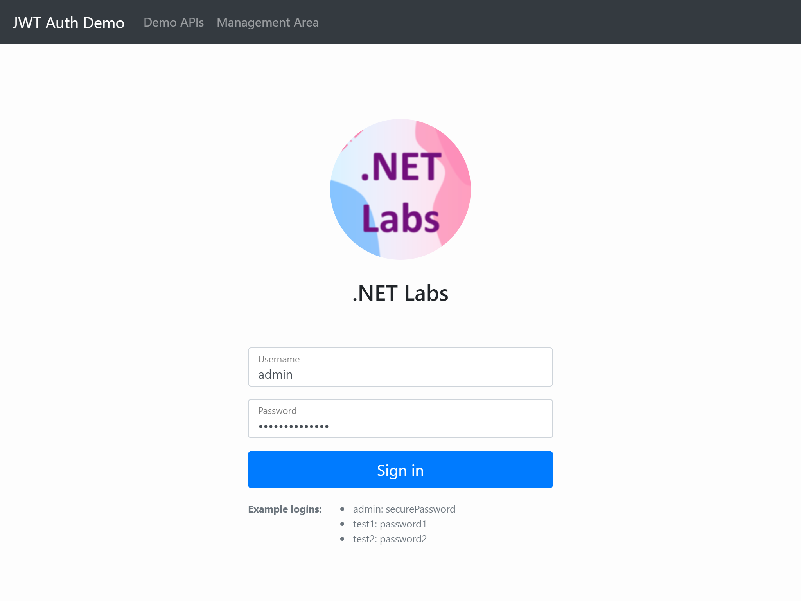
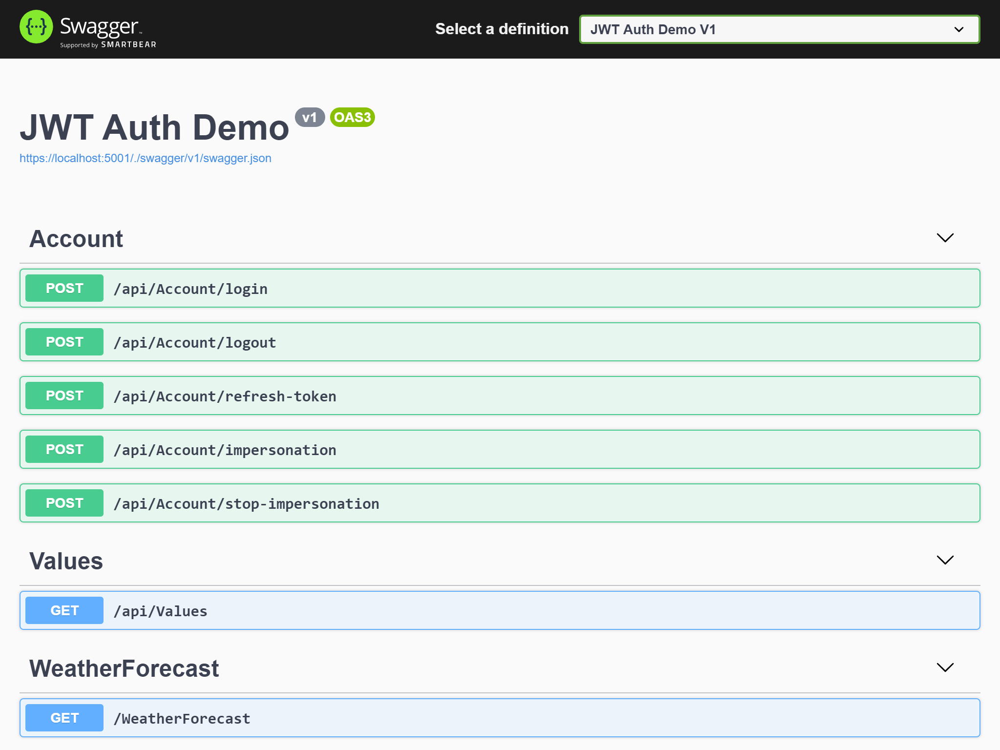

# JWT Auth Demo (Angular + ASP.NET Core)

This repository demos an Angular SPA and an ASP.NET Core web API application using JWT auth, and an integration testing project for a set of actions including login, logout, refresh token, impersonation, authentication, and authorization.

- **Front-end** ([http://localhost:8080](http://localhost:8080))

  

- **Back-end** ([https://localhost:5001](https://localhost:5001))

  
